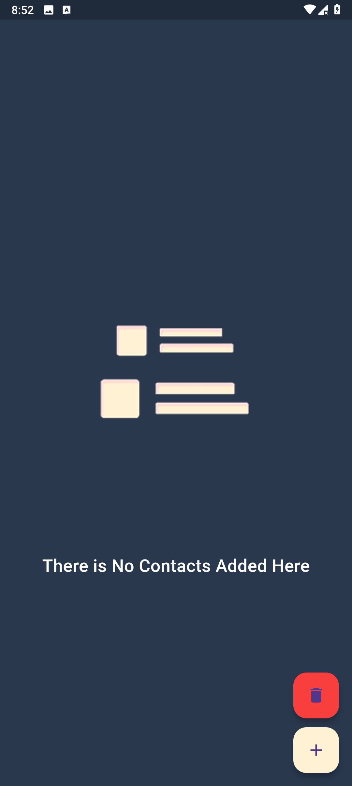
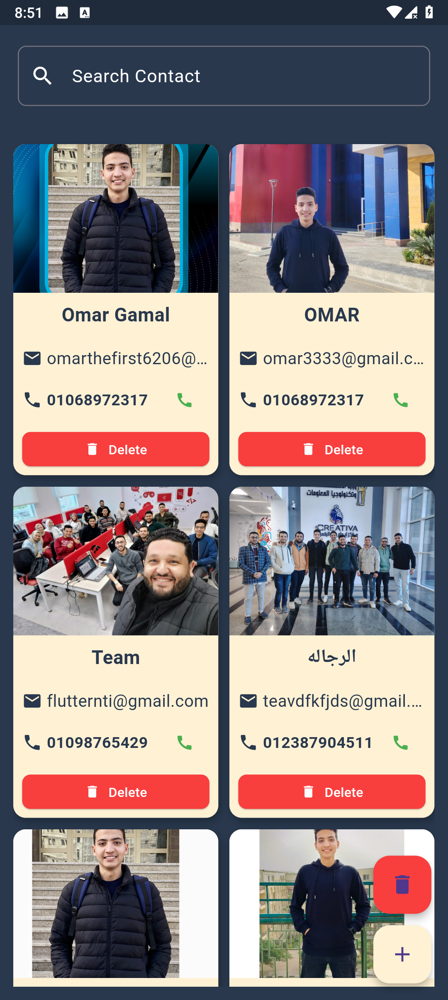
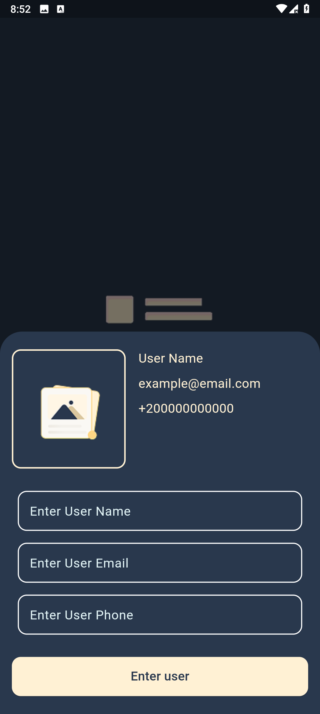

# 📱 Contact App

A simple and elegant **Flutter contacts management app** that allows users to add, search, display, and delete contacts. Built using **Hive** for local persistent storage and clean UI with **ScreenUtil** for responsiveness.

---

## 📸 Screenshots

| Home Screen | Contacts Grid | Add Contact |
|-------------|---------------|--------------|
|  |  |  |

---

## Features

-  Add new contacts (name, email, phone, and image).
-  Real-time search functionality.
-  Persistent local storage using Hive.
-  Clear all contacts with a single button.
-  Responsive design using ScreenUtil.
-  Direct phone call integration with permission handling.

---

## Packages Used

| Package | Description |
|--------|-------------|
| `hive` | Lightweight & blazing fast key-value database |
| `hive_flutter` | Integration of Hive with Flutter |
| `hive_generator` + `build_runner` | Code generation for Hive adapters |
| `flutter_screenutil` | Screen size adaptation for responsiveness |
| `image_picker` | Pick image from gallery or camera |
| `flutter_phone_direct_caller` | Call phone numbers directly from the app |
| `permission_handler` | Manage runtime permissions easily |

---

##  Getting Started

1. **Clone the repository:**

   ```bash
   git clone https://github.com/your_username/contact_app.git
   cd contact_app
   ```

2. **Install dependencies:**

   ```bash
   flutter pub get
   ```

3. **Generate Hive adapter:**

   ```bash
   flutter pub run build_runner build
   ```

4. **Run the app:**

   ```bash
   flutter run
   ```

---

## Structure

```
lib/
├── features/
│   └── home/
│       ├── model/
│       │   └── contact_model.dart
│       ├── widgets/
│       │   ├── add_contact_bottom_sheet.dart
│       │   ├── contact_card.dart
│       │   └── custom_floating_action_button.dart
│       └── home_screen.dart
├── main.dart
```

---

## Hive Storage

* Box name: `'contactsBox'`
* Stored Model: `ContactModel`
* Generated Adapter: `ContactModelAdapter`

---

## Notes

* Make sure you call `Hive.registerAdapter(ContactModelAdapter())` before opening the box.
* This project uses `TextEditingController` to preserve search input even when navigating between screens.

---

## Contact

Made with by **Omar Gamal**

[LinkedIn](https://www.linkedin.com/in/omar-gamal-6508652a1/) • [GitHub](https://github.com/OmarGamal-MobileApps-developer)
